# Fortune-5 Deployment + RevOps Mermaid Atlas

## Purpose

This document renders the same target system through every diagram family currently listed in Mermaid's syntax catalog: Fortune-5 customer acquisition, procurement, entitlement, deployment, process-intelligence operation, usage evidence, billing, collection, settlement, and final posting to **USAA checking (beneficiary account)**.

The bank endpoint is intentionally abstract. No account number, routing number, login, token, or other banking secret belongs in source control.

## Economic/authority boundary

These diagrams distinguish separate events that must never be collapsed:

`opportunity -> contract -> entitlement -> deployment -> observed usage -> admitted usage -> invoice -> collection -> fees/tax -> settlement instruction -> bank posting`

- A booking is not cash.
- Revenue recognition is not bank settlement.
- A usage event is not an invoice.
- An invoice is not a collected payment.
- A settlement instruction is not a posted bank transaction.
- Beam4PM may construct and receipt commercial state, but external marketplace/payment/banking rails retain their own authority for actual money movement.
- Final settlement is represented only as `USAA checking (beneficiary account)`.

## Compatibility note

Some Mermaid diagram families are recent or beta features and may require a newer Mermaid runtime than the renderer embedded by GitHub. The source is retained because this atlas is intended to cover the current Mermaid catalog, not only the subset rendered by one host.

---

## 1. Flowchart — end-to-end Fortune-5 lead-to-cash

```mermaid
flowchart LR
    F5[Fortune-5 Customer] --> DISC[Discovery / Value Baseline]
    DISC --> OFFER[Private Offer / Enterprise Contract]
    OFFER --> MP[Cloud Marketplace or Direct Channel]
    MP --> ENT[Entitlement Activated]
    ENT --> DEP[Deploy beam4pm_pro in Customer Boundary]
    DEP --> OBS[Observe OTEL / K8s / BEAM / Domain Events]
    OBS --> PI[Process Intelligence + Value Receipts]
    PI --> USAGE[Admitted Usage / Contract Consumption]
    USAGE --> BILL[Billing Reconciliation]
    BILL --> INV[Invoice / Marketplace Charge]
    INV --> COLLECT[Customer Payment Collected]
    COLLECT --> DEDUCT[Marketplace Fees / Tax / Adjustments]
    DEDUCT --> SETTLE[Net Settlement Instruction]
    SETTLE --> BANK[USAA checking\nbeneficiary account]
    PI --> RENEW[QBR / Renewal / Expansion]
    RENEW --> OFFER
```

## 2. Swimlanes — ownership and handoffs

```mermaid
swimlane-beta LR
  subgraph customer [Fortune-5 Customer]
    need[Approve business case]
    sec[Security / architecture approval]
    use[Operate deployment]
    pay[Approve and pay invoice]
  end

  subgraph beam [Beam4PM]
    discover[Produce evidence pack]
    provision[Bind entitlement]
    deploy[Manufacture / deploy product]
    meter[Generate governed usage receipts]
    reconcile[Reconcile billing state]
  end

  subgraph market [Marketplace / Channel]
    offer[Accept private offer]
    entitlement[Issue entitlement]
    invoice[Invoice / collect]
    payout[Create seller settlement]
  end

  subgraph bank [Banking Rail]
    ach[ACH / payout rail]
    usaa[USAA checking beneficiary posting]
  end

  need --> discover --> sec --> offer
  offer --> entitlement --> provision --> deploy --> use
  use --> meter --> reconcile --> invoice --> pay
  pay --> payout --> ach --> usaa
```

## 3. Sequence — commercial and settlement protocol

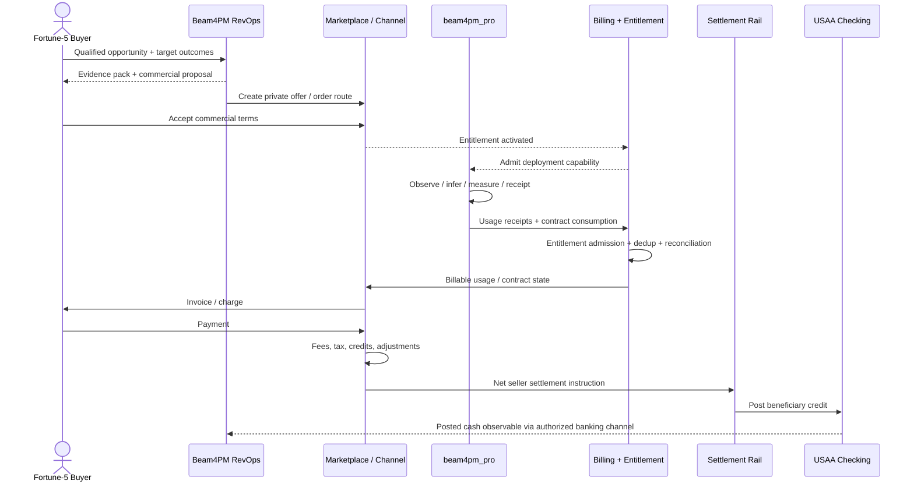

## 4. Class — commercial object model

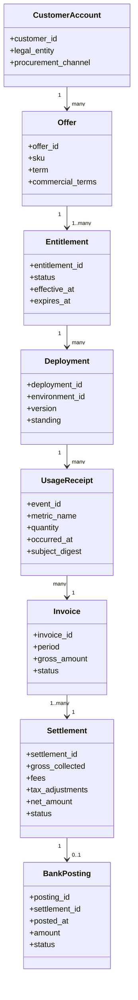

## 5. State — opportunity to cash-posted standing

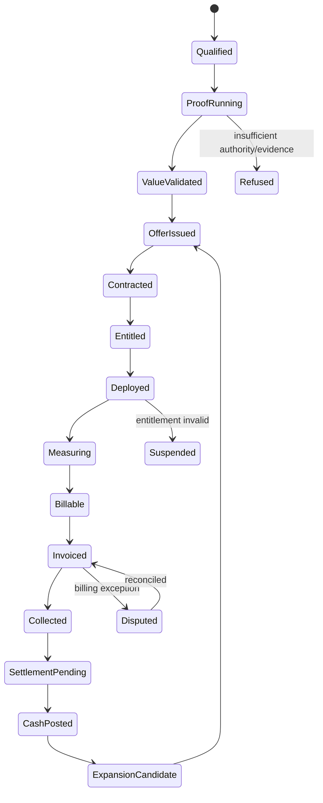

## 6. Entity Relationship — RevOps evidence store

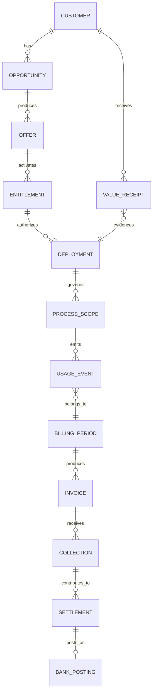

## 7. User Journey — Fortune-5 buyer/admin/finance experience

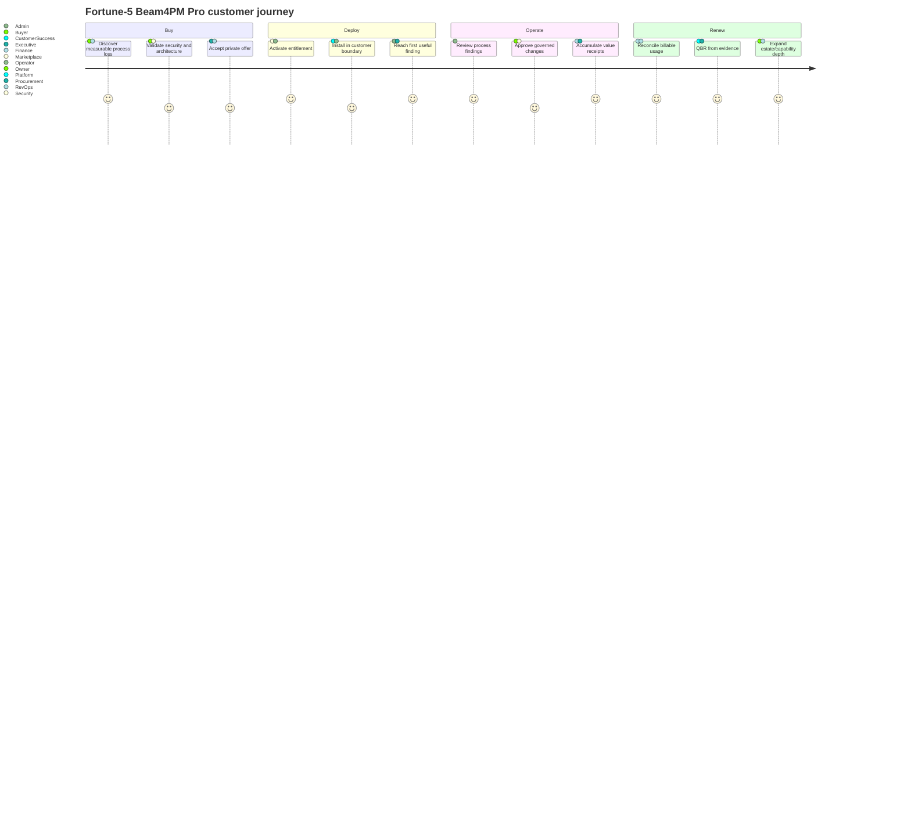

## 8. Gantt — representative enterprise deployment + first settlement

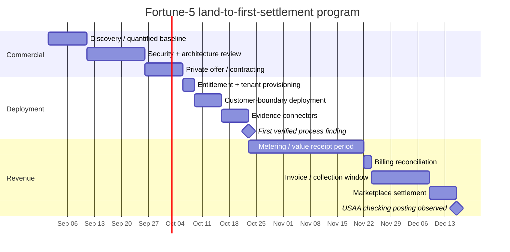

## 9. Pie — illustrative 100-unit collected-cash waterfall

> Illustrative only; not pricing, tax, marketplace-fee, accounting, or bank evidence.

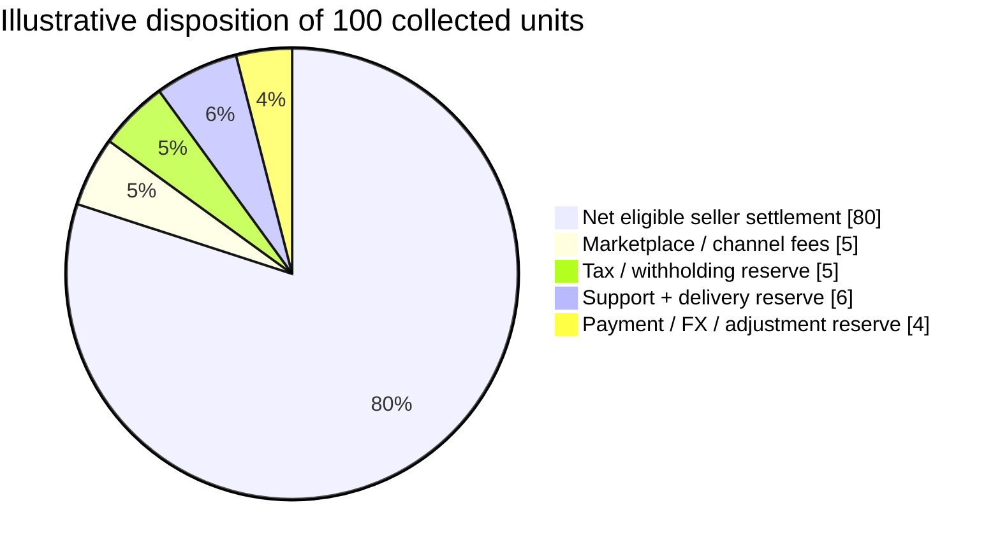

## 10. Quadrant — customer deployment strategy

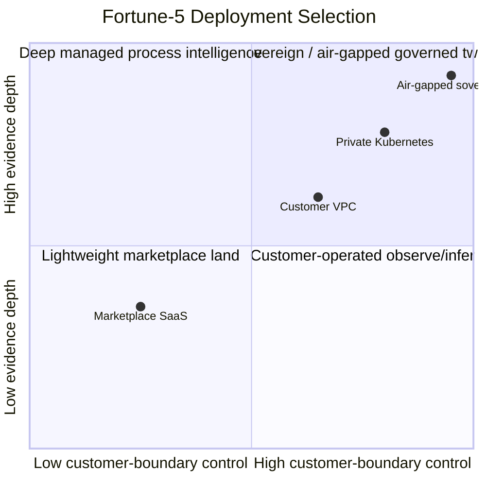

## 11. Requirement — commercial closure invariants

```mermaid
requirementDiagram
    direction LR

    functionalRequirement zero_unreceipted_actuation {
      id: R1
      text: Every production-changing action must cross admission, authority, actuation, and receipt boundaries.
      risk: high
      verifymethod: test
    }

    functionalRequirement entitled_usage_only {
      id: R2
      text: Usage may become billable only when an active entitlement admits it.
      risk: high
      verifymethod: test
    }

    functionalRequirement no_double_billing {
      id: R3
      text: Replay or duplicate delivery must not create duplicate billable usage.
      risk: high
      verifymethod: test
    }

    interfaceRequirement settlement_identity {
      id: R4
      text: Every bank posting must trace to a settlement identity without storing banking secrets in source.
      risk: high
      verifymethod: inspection
    }

    element runtime {
      type: beam4pm_pro runtime
    }
    element billing {
      type: entitlement and billing rail
    }
    element payout {
      type: authorized external settlement rail
    }
    element bank {
      type: USAA checking beneficiary endpoint
    }

    runtime - satisfies -> zero_unreceipted_actuation
    billing - satisfies -> entitled_usage_only
    billing - satisfies -> no_double_billing
    payout - satisfies -> settlement_identity
    bank - traces -> settlement_identity
```

## 12. GitGraph — manufactured release to Fortune-5 production

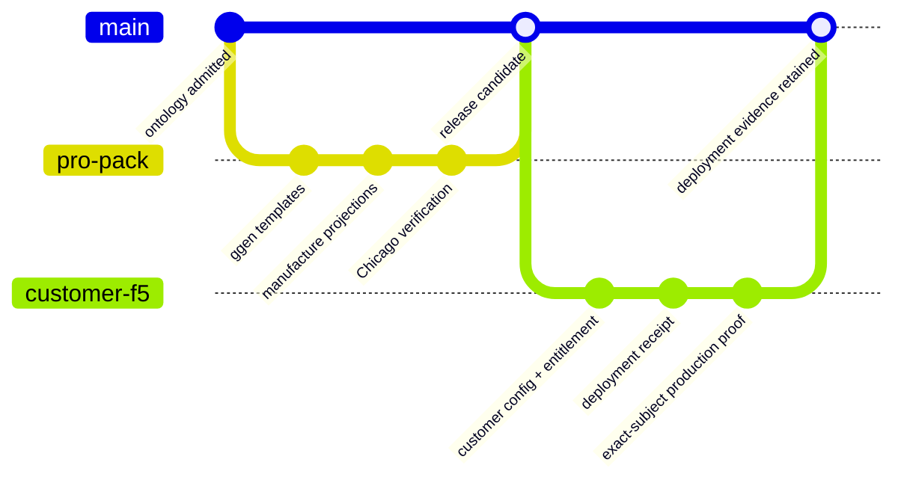

## 13. C4 family — context, container, component, dynamic, deployment

### 13.1 C4 System Context

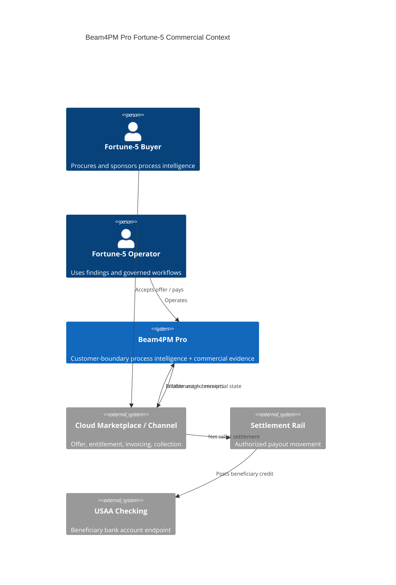

### 13.2 C4 Container

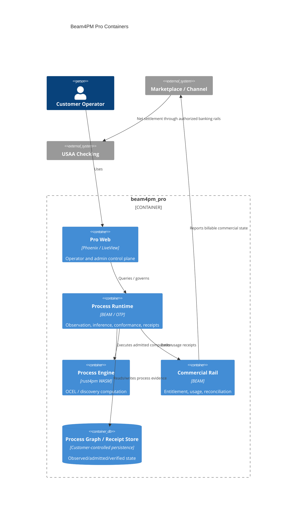

### 13.3 C4 Component

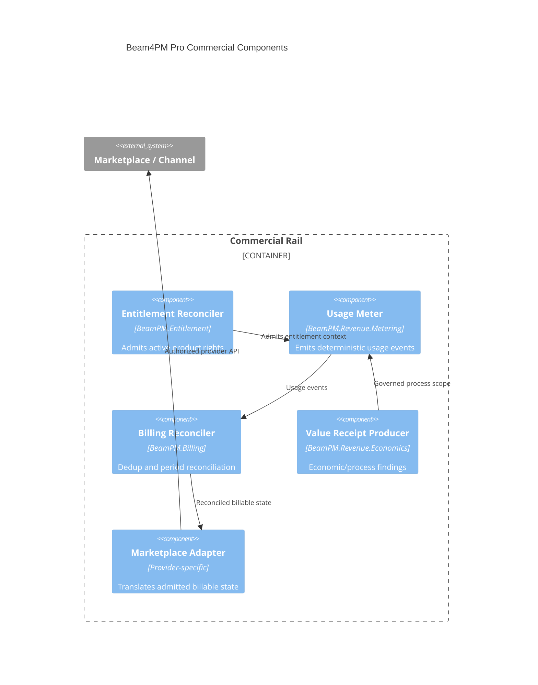

### 13.4 C4 Dynamic

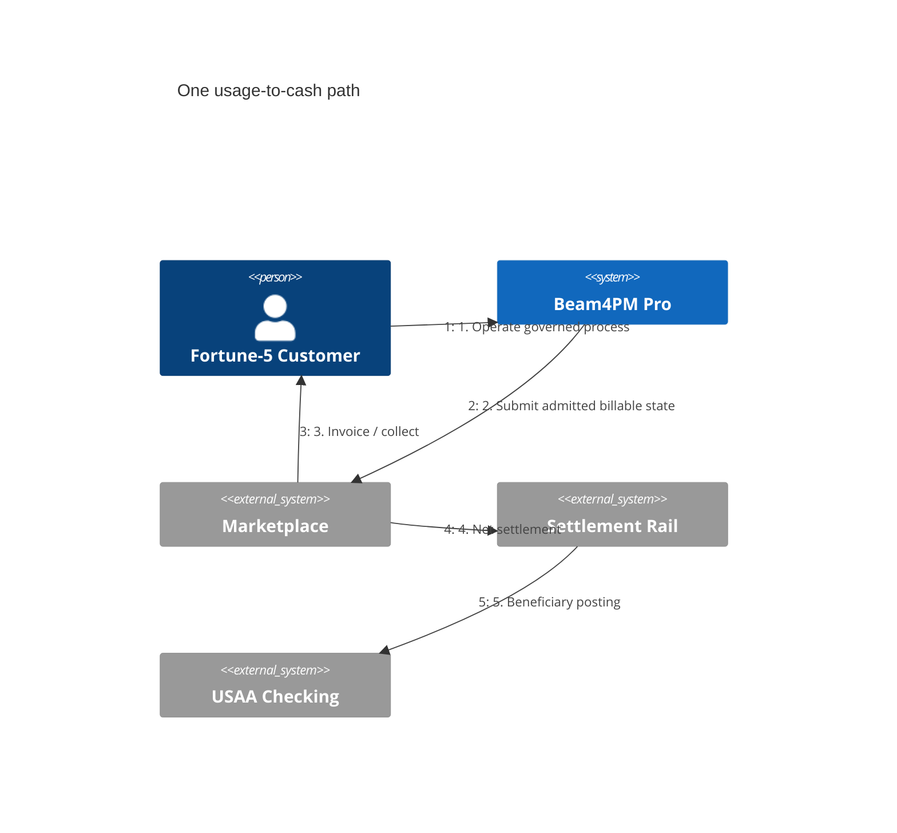

### 13.5 C4 Deployment

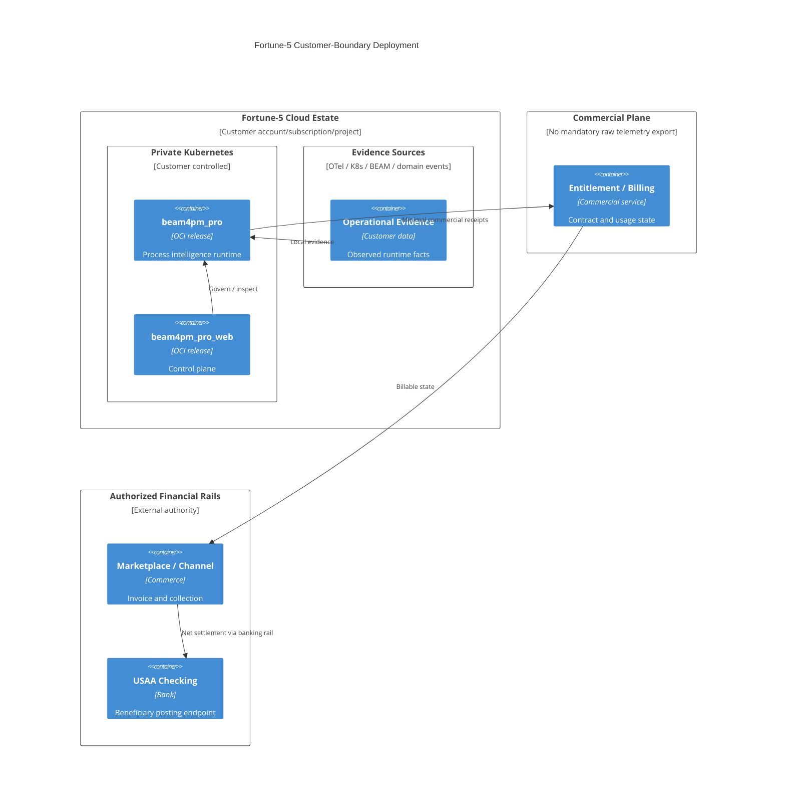

## 14. Mindmap — Fortune-5 product + revenue system

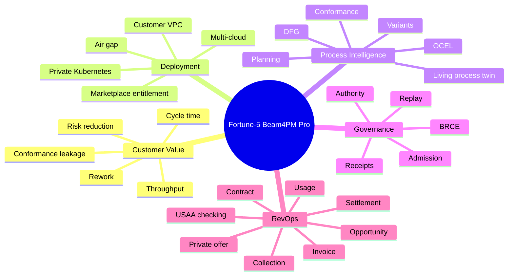

## 15. Timeline — lead to bank posting

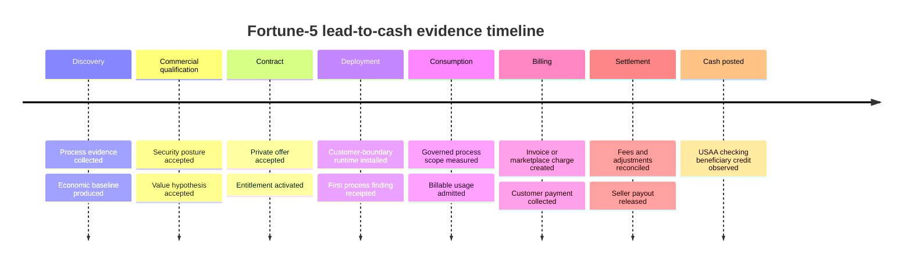

## 16. ZenUML — usage-to-settlement interaction

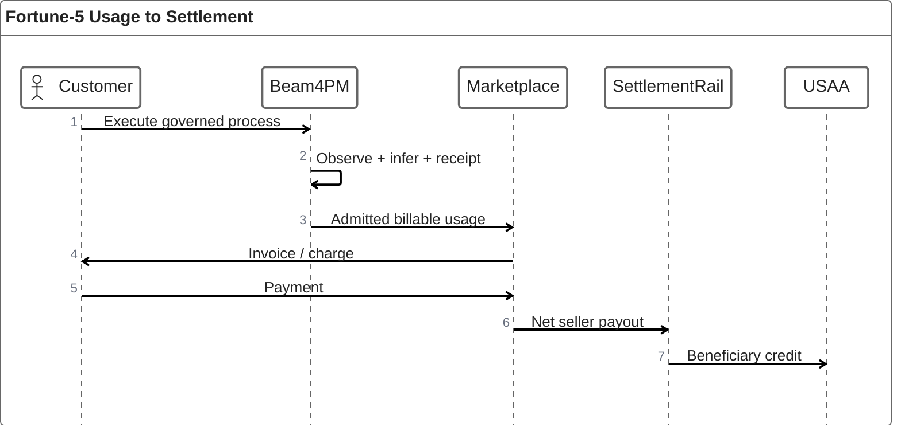

## 17. Sankey — illustrative commercial cash flow

> Values are illustrative units only, not actual pricing, tax, fees, or bank activity.

```mermaid
sankey

Fortune-5 collected payment,Gross collected revenue,100
Gross collected revenue,Marketplace and payment fees,5
Gross collected revenue,Tax and withholding reserve,5
Gross collected revenue,Net seller settlement,90
Net seller settlement,USAA checking beneficiary posting,90
```

## 18. XY Chart — illustrative expansion curve

> Illustrative planning scenario only.

```mermaid
xychart
    title "Illustrative Fortune-5 Expansion: Estate Coverage vs Contract Value Index"
    x-axis [Pilot, Department, BusinessUnit, Enterprise, MultiCloud]
    y-axis "Normalized contract value index" 0 --> 100
    bar [10, 25, 45, 75, 100]
    line [8, 22, 48, 78, 100]
```

## 19. Block — control-plane topology

```mermaid
block
  columns 4
  customer["Fortune-5 Estate"] space market["Marketplace / Channel"] finance["Authorized Financial Rails"]
  obs["OTel + K8s + BEAM evidence"] pro["beam4pm_pro"] commercial["Entitlement + Billing"] usaa["USAA checking"]
  customer --> obs
  obs --> pro
  pro --> commercial
  market --> commercial
  commercial --> market
  market --> finance
  finance --> usaa
```

## 20. Packet — usage receipt wire envelope

```mermaid
packet
    title Beam4PM Pro Usage Receipt Envelope
    +32: "Schema / version"
    +128: "Entitlement identity digest"
    +128: "Deployment / subject digest"
    +128: "Metric identity digest"
    +64: "Quantity"
    +64: "Occurred-at epoch"
    +128: "Event identity / dedup digest"
    +128: "Receipt / provenance digest"
```

The packet depicts an abstract wire envelope, not a committed binary protocol.

## 21. Kanban — Fortune-5 revenue closure work

```mermaid
kanban
  discover[Discover]
    k1[Quantify customer process loss]
    k2[Produce security evidence]
  contract[Contract]
    k3[Private offer]
    k4[Entitlement mapping]
  deploy[Deploy]
    k5[Customer-boundary install]
    k6[First finding receipt]
  consume[Consume]
    k7[Usage admission]
    k8[Value receipts]
  bill[Bill]
    k9[Reconcile period]
    k10[Invoice / marketplace charge]
  settle[Settle]
    k11[Collection confirmed]
    k12[Net payout]
    k13[USAA posting observed]
```

## 22. Architecture — Fortune-5 deployment fabric

```mermaid
architecture-beta
    group customer(cloud)[Fortune 5 Customer Estate]
    group commerce(cloud)[Commercial Plane]
    group settlement(cloud)[Authorized Settlement]

    service evidence(server)[OTel K8s BEAM Evidence] in customer
    service runtime(server)[beam4pm pro Runtime] in customer
    service graph(database)[Process Graph and Receipts] in customer
    service control(server)[Pro Control Plane] in customer

    service entitlement(server)[Entitlement and Billing] in commerce
    service marketplace(server)[Marketplace Channel] in commerce

    service payout(server)[Settlement Rail] in settlement
    service usaa(database)[USAA Checking] in settlement

    evidence:R --> L:runtime
    runtime:B --> T:graph
    control:B --> T:runtime
    runtime:R --> L:entitlement
    entitlement:R --> L:marketplace
    marketplace:R --> L:payout
    payout:R --> L:usaa
```

## 23. Radar — deployment readiness comparison

> Scores are illustrative design targets, not observed benchmarks.

```mermaid
radar-beta
    title Fortune-5 Deployment Readiness Target
    axis sec[Security], air[Air Gap], scale[Fleet Scale], obs[Observability], rev[RevOps], replay[Replayability]
    curve pilot["Pilot"]{70,30,40,80,45,75}
    curve enterprise["Enterprise Target"]{95,80,95,95,95,95}
    max 100
    min 0
```

## 24. Event Modeling — commerce as an event-sourced business process

```mermaid
eventmodeling
    tf 01 ui RevOps.OfferUI
    tf 02 cmd Commerce.IssuePrivateOffer
    tf 03 evt Commerce.OfferIssued
    tf 04 ui Customer.AcceptOfferUI
    tf 05 cmd Commerce.AcceptOffer
    tf 06 evt Commerce.EntitlementActivated
    tf 07 pcr Runtime.UsageProcessor
    tf 08 cmd Billing.AdmitUsage
    tf 09 evt Billing.UsageAdmitted
    tf 10 pcr Commerce.InvoiceProcessor
    tf 11 cmd Commerce.CreateInvoice
    tf 12 evt Commerce.PaymentCollected
    tf 13 pcr Settlement.PayoutProcessor
    tf 14 cmd Settlement.ReleasePayout
    tf 15 evt Settlement.PayoutReleased
    tf 16 evt Banking.UsaaPostingObserved
```

## 25. Treemap — operating surface proportions

> Values are illustrative relative attention units, not financial allocation.

```mermaid
treemap-beta
    "Fortune-5 Beam4PM Pro Program"
        "Customer Deployment"
            "Security and architecture": 18
            "Evidence connectors": 14
            "Runtime and process twin": 18
        "Commercial"
            "Entitlement": 10
            "Billing and usage": 12
            "Marketplace adapters": 8
        "Operations"
            "Support and diagnostics": 8
            "Upgrade and release": 7
            "Receipts and replay": 5
```

## 26. Venn — where paid product value exists

```mermaid
venn-beta
    title "Beam4PM Pro Value Intersection"
    set Process["Process Intelligence"]
    set Enterprise["Enterprise Operability"]
    set Commercial["Commercial Closure"]
    union Process,Enterprise["Deployable intelligence"]
    union Process,Commercial["Measurable value to revenue"]
    union Enterprise,Commercial["Procure-to-operate product"]
    union Process,Enterprise,Commercial["Fortune-5 Beam4PM Pro"]
```

## 27. Ishikawa — causes of failure to reach cash-posted ALIVE

```mermaid
ishikawa-beta
    Cash Not Posted to Beneficiary Account
    Product
        No first-value finding
        Unsupported customer topology
        Upgrade incompatibility
    Commercial
        Offer not accepted
        Entitlement inactive
        Usage not billable
        Invoice disputed
    Evidence
        Missing receipt identity
        Duplicate usage
        Unbounded inference
    Marketplace
        Provider API failure
        Listing or private-offer defect
        Collection not completed
    Settlement
        Payout held
        Fee or tax adjustment
        Bank rail rejection
    Banking
        Beneficiary mismatch
        Posting pending
        Reconciliation identity missing
```

## 28. Wardley — strategic position of the Fortune-5 product stack

```mermaid
wardley-beta
    title Fortune-5 Beam4PM Pro Value Chain

    anchor ExecutiveOutcome [0.95, 0.45]
    component ProcessFinding [0.82, 0.42]
    component ProcessTwin [0.70, 0.35]
    component BeamRuntime [0.58, 0.60]
    component OpenTelemetry [0.46, 0.82]
    component Kubernetes [0.36, 0.88]
    component MarketplaceCommerce [0.55, 0.80]
    component BankingRail [0.25, 0.95]

    ExecutiveOutcome -> ProcessFinding
    ProcessFinding -> ProcessTwin
    ProcessTwin -> BeamRuntime
    BeamRuntime -> OpenTelemetry
    BeamRuntime -> Kubernetes
    ExecutiveOutcome -> MarketplaceCommerce
    MarketplaceCommerce -> BankingRail

    evolve ProcessTwin 0.60
    evolve ProcessFinding 0.58
```

## 29. Cynefin — where different RevOps/deployment work belongs

```mermaid
cynefin-beta
    title Fortune-5 Beam4PM Pro Operating Decisions

    clear
      "Deterministic entitlement reconciliation"
      "Usage deduplication"
      "Release signature verification"

    complicated
      "Enterprise security architecture"
      "Tax / marketplace accounting interpretation"
      "Multi-cloud deployment design"

    complex
      "New customer process discovery"
      "Pricing and packaging experiments"
      "Organizational adoption"

    chaotic
      "Production outage"
      "Settlement rail incident"
      "Compromised credential event"

    confusion
      "Unclassified customer evidence"

    complex --> complicated : "repeatable pattern established"
    complicated --> clear : "encoded as deterministic policy"
    chaotic --> complex : "stabilized and evidence collected"
```

## 30. TreeView — deployable Fortune-5 product bundle

```mermaid
treeView-beta
    beam4pm-pro-fortune5/
        product/
            beam4pm/
            beam4pm_pro/
            beam4pm_pro_web/
            connectors/
        deployment/
            kubernetes/
            airgap/
            marketplace/
        evidence/
            ocel/
            otel/
            k8s/
            beam-runtime/
        governance/
            admission/
            authority/
            receipts/
            replay/
        revops/
            opportunity/
            offer/
            entitlement/
            usage/
            billing/
            settlement/
        banking/
            beneficiary/
                "USAA checking (no secrets in repo)"
```

---

# Cross-diagram canonical process

All diagrams above are projections of one canonical commercial/deployment process:

```text
Fortune-5 need
  -> quantified process opportunity
  -> qualified enterprise opportunity
  -> commercial offer / private offer
  -> accepted contract/order
  -> entitlement
  -> customer-boundary deployment
  -> observed execution
  -> process graph / process twin
  -> finding + value receipt
  -> admitted usage / contract consumption
  -> billing reconciliation
  -> invoice / marketplace charge
  -> collection
  -> provider/channel deductions and adjustments
  -> net settlement
  -> authorized banking rail
  -> USAA checking beneficiary posting
  -> reconciliation receipt
  -> renewal / expansion evidence
```

## Required standing ledger

For an actual Fortune-5 deployment, track each edge independently:

| Edge | Standing required |
| --- | --- |
| Opportunity evidence | `ALIVE` only when sourced from observed customer evidence |
| Offer | `ALIVE` only when the exact commercial object exists |
| Entitlement | `ALIVE` only when provider/direct entitlement is observed and active |
| Deployment | `ALIVE` only after exact-subject execution in the admitted customer environment |
| Process finding | `ALIVE` only with observed evidence and replayable derivation |
| Usage | `ALIVE` only after entitlement admission and deduplication |
| Invoice | `ALIVE` only when the authorized commerce system creates it |
| Collection | `ALIVE` only when payment is actually collected |
| Settlement | `ALIVE` only when the provider/payment rail releases the seller payout |
| USAA posting | `ALIVE` only when an authorized banking observation confirms the beneficiary posting |

The final bank leg therefore cannot be inferred from a Beam4PM receipt, marketplace invoice, or settlement schedule. It requires its own observed banking evidence.