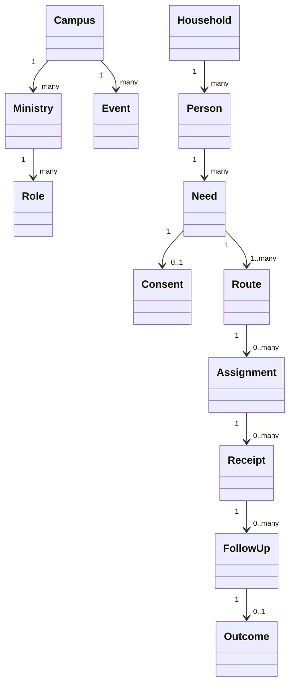
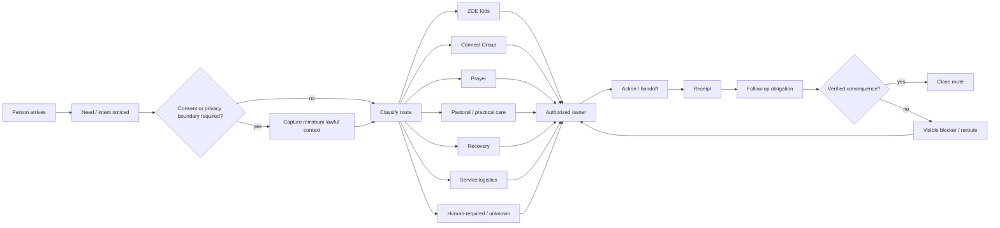
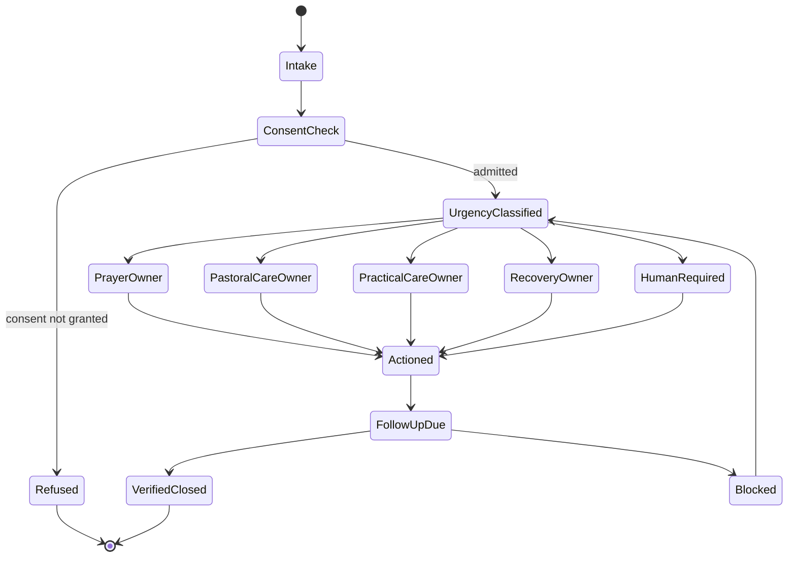
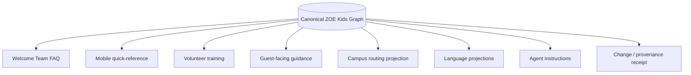
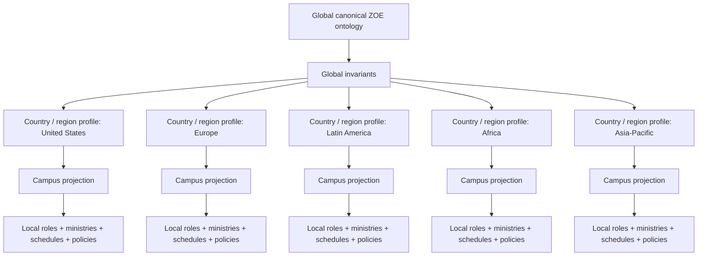
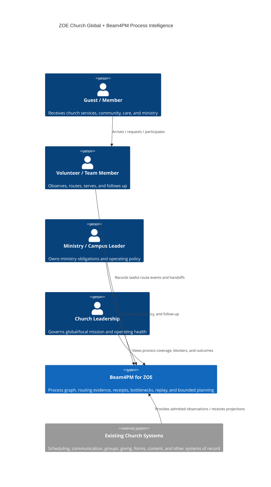
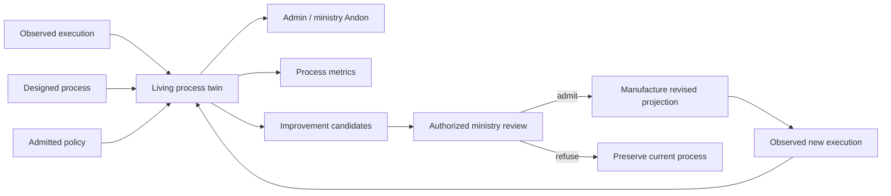

# Case Study 001 — ZOE Church Global

## Status

- Case-study subject: **ZOE Church**
- Strategic scenario: **ZOE Church going global**
- Product role: first concrete `beam4pm_pro` customer case study
- Standing: **DESIGN SPECIFICATION / UNKNOWN customer-production standing**
- Rule: this document does not claim that any described global deployment, integration, outcome, or financial result has occurred until the exact subject is observed and receipted.

## Why ZOE is the first case study

ZOE is a strong first proving ground because the operating system is fundamentally process-centric rather than transaction-centric. The church is not one application. It is a living network connecting people, households, services, campuses, ministries, prayer, Kids, groups, recovery, pastoral care, hospitality, teaching, volunteer teams, follow-up, discipleship, outreach, and community mission.

The hard problem is therefore not "build a church app." The hard problem is:

> Preserve the identity, consent, ownership, timing, handoffs, obligations, evidence, policy, and verified consequences of thousands of human service routes while the organization expands across campuses, cities, countries, languages, cultures, and ministry teams.

That is a direct match for Beam4PM's intended process-intelligence model.

## North-star global loop

```text
person / household / community need
  -> observed signal
  -> lawful intake
  -> consent + privacy boundary
  -> classification
  -> responsible ministry / role
  -> assignment
  -> action / service / care
  -> receipt
  -> follow-up
  -> verified outcome or explicit unresolved state
  -> learning
  -> improved global/local process model
```

The global operating model must never replace pastoral judgment, ministry authority, consent, or human relationships with an opaque automation. Beam4PM provides process memory, routing, evidence, bottleneck detection, coverage, replay, and bounded planning; authorized ministry owners retain authority for real-world care and decisions.

---

# 1. Canonical ZOE service ontology

The canonical graph should represent at least:

- `Person`
- `Household`
- `Campus`
- `Region`
- `Country`
- `Language`
- `Event`
- `Service`
- `Ministry`
- `Role`
- `Volunteer`
- `Need`
- `PrayerRequest`
- `CareRequest`
- `KidsRequest`
- `GroupRequest`
- `RecoveryRequest`
- `Resource`
- `Consent`
- `PrivacyPolicy`
- `Route`
- `Assignment`
- `Handoff`
- `TimeWindow`
- `Obligation`
- `Evidence`
- `Receipt`
- `FollowUp`
- `Outcome`
- `Blocker`

Public ontologies remain the interoperability layer where applicable; ZOE-specific semantics specialize the church domain rather than redefining generic identity, provenance, policy, or event concepts.

The graph is the source of truth. Mobile apps, web portals, dashboards, FAQs, printed guidance, training materials, voice walkthroughs, agent interfaces, and reports are projections.



---

# 2. First process family — hospitality / threshold routing

The first observed system should be the church threshold: what happens from the moment a person arrives until the person reaches the correct next owner or destination.

This is operationally important because arrival contains many failure-prone transitions:

- first-time guest identification;
- greeting before downstream security or logistical routing;
- families with children;
- ZOE Kids questions and escort paths;
- accessibility or service-animal questions;
- seating and service-time changes;
- Connect Group interest;
- prayer requests;
- pastoral-care needs;
- recovery-related needs;
- practical assistance;
- unresolved or human-required situations.

A good threshold system minimizes the chance that someone must repeat the same story to multiple people.



## Threshold acceptance metrics

Measure from real event evidence where lawful:

- time to notice;
- time to classify;
- time to consent where required;
- time to first responsible owner;
- wrong-route rate;
- missing-consent rate;
- unowned-intake rate;
- repeat-story count;
- handoff abandonment;
- receipt completeness;
- false completion rate;
- verification failure rate;
- unresolved blocker age.

These are process metrics, not performance judgments about individual volunteers.

---

# 3. Prayer and care routing

Prayer/care intake is a high-value process because the product must preserve dignity, consent, urgency, ownership, and closure without turning a human ministry interaction into a ticket queue.

Minimum admissible route state:

```text
need observed
  -> minimum context
  -> consent/privacy
  -> urgency
  -> responsible owner
  -> action
  -> receipt
  -> follow-up
  -> verified closure / explicit unresolved state
```

Valid outcomes can include:

- prayer offered;
- follow-up sent;
- pastoral-care owner assigned;
- Connect Group route;
- practical provision route;
- recovery route;
- human-required boundary;
- consent-based refusal;
- verified closure.



---

# 4. ZOE Kids as the first structured knowledge + routing projection

The Kids workflow should demonstrate that one admitted operating graph can project into multiple useful surfaces without duplicating operational truth.

A single canonical model can manufacture:

- Welcome Team FAQ;
- mobile quick-reference;
- volunteer training;
- guest-facing information;
- campus-specific routing instructions;
- age-bracket guidance;
- location/handoff maps;
- leader escalation rules;
- multi-language variants;
- agent-readable operational instructions.

The same underlying facts should not be separately hand-maintained across each artifact.



---

# 5. Global campus replication model

Going global must not mean copying a monolithic Los Angeles configuration everywhere.

The global model is:

```text
Global canonical church ontology
  x global invariants
  x country / legal / privacy profile
  x language profile
  x campus topology
  x local ministries and roles
  x local schedules/resources
  x local authority graph
  -> admitted campus operating projection
```

Global invariants may include process identity, provenance, consent semantics, receipt structure, route lifecycle, and evidence vocabulary. Local projections may vary by language, ministry names, physical layout, service times, legal requirements, available resources, escalation paths, and responsible people.



## Global replication falsifier

The model is failing if a new campus requires a bespoke software fork rather than a bounded local specialization of the canonical graph.

---

# 6. Beam4PM deployment topology for ZOE

The first useful deployment does not need to begin with a huge centralized SaaS estate.

Start with one bounded operational slice and expand only when evidence shows value.



Beam4PM should complement existing systems rather than requiring wholesale replacement. Connectors should preserve each external system's identity and authority.

---

# 7. Global operating twin

The process twin should keep distinct projections for:

- designed process;
- current campus configuration;
- observed execution;
- inferred process behavior;
- admitted process policy;
- verified outcomes;
- unresolved / unknown state.

This permits questions such as:

- Which campuses have the highest unowned-intake rate?
- Where do guests repeat their story most often?
- Which follow-up obligations are aging?
- Which ministry handoffs differ materially from the designed route?
- Which process variants produce better verified closure?
- Where has a local campus discovered a superior route that should be considered for global adoption?
- Which global process assumptions fail in a specific local culture, language, or legal context?

The system should preserve local improvements rather than forcing premature standardization.

---

# 8. DfCM global expansion

Design for Combinatorial Maximalism is useful here because global expansion creates many legitimate route possibilities.

For each person/need/context, preserve the largest lawful reversible set before selection:

```text
candidate routes
  - prayer
  - Connect Group
  - pastoral care
  - recovery
  - Kids
  - practical help
  - volunteer/service opportunity
  - event
  - content/resource
  - local campus owner
  - remote/global specialist
  - human-required escalation
  - consent-based refusal
```

Bound the graph by:

- consent;
- privacy;
- safeguarding;
- ministry authority;
- geography;
- language;
- urgency;
- resource capacity;
- legal constraints;
- evidence quality;
- local policy.

One unavailable edge must not collapse the route graph.

---

# 9. Case-study rollout

## Phase Z0 — observe one threshold

Scope one service arrival flow.

Acceptance:

- real arrival/routing events observed;
- ownership transitions represented;
- no fabricated closure;
- repeat-story and unowned-intake measurable;
- receipts can replay one complete route.

Crown: `ZOE_THRESHOLD_ALIVE`.

## Phase Z1 — Kids + guest routing

Acceptance:

- one canonical Kids model projects to at least three operational surfaces;
- campus-specific location/routing specialization does not fork canonical semantics;
- update to one admitted fact regenerates every affected projection deterministically.

Crown: `ZOE_KIDS_ROUTE_ALIVE`.

## Phase Z2 — prayer/care/recovery

Acceptance:

- consent, privacy, urgency, owner, action, receipt, follow-up, and closure are distinguishable;
- human-required boundaries are explicit;
- no unresolved case is reported as completed.

Crown: `ZOE_CARE_ROUTE_ALIVE`.

## Phase Z3 — campus process twin

Acceptance:

- designed vs observed process states are queryable;
- variants, bottlenecks, aging obligations, and routing defects are visible;
- local leaders can inspect why an edge exists.

Crown: `ZOE_CAMPUS_TWIN_ALIVE`.

## Phase Z4 — multi-campus replication

Acceptance:

- same canonical model operates across multiple campuses;
- local specializations are explicit inputs rather than forks;
- cross-campus comparisons preserve context and do not equate incompatible processes.

Crown: `ZOE_MULTICAMPUS_ALIVE`.

## Phase Z5 — international projection

Acceptance:

- at least two country/language profiles operate from the same canonical model;
- privacy/legal/local-authority differences are admitted explicitly;
- local language and operating projections regenerate without source forks;
- evidence remains attributable to exact campus/version/profile.

Crown: `ZOE_GLOBAL_PROJECTION_ALIVE`.

## Phase Z6 — global learning loop

Acceptance:

- a locally observed superior process variant can be proposed to the global model;
- proposal remains separate from actuation;
- global policy admission is explicit;
- affected campus projections can be regenerated and replay-tested before adoption.

Crown: `ZOE_GLOBAL_LEARNING_LOOP_ALIVE`.

---

# 10. Mission-value receipts

Traditional RevOps is not the right value language for every church process. The case study should therefore quantify mission-operating evidence without pretending every outcome is monetary.

Candidate receipts:

- people successfully routed;
- time to first responsible owner;
- follow-up completion;
- unresolved-needs aging;
- repeat-story reduction;
- Kids routing accuracy;
- prayer/care handoff completion;
- recovery connection completion;
- group-match completion;
- volunteer onboarding cycle time;
- service-team capacity and bottlenecks;
- number of campuses operating from the canonical model;
- number of local improvements promoted into reusable global patterns.

Where economic analysis is useful, keep it separate from ministry outcomes. Cost, staffing, capacity, and resource efficiency can be measured without reducing pastoral or spiritual outcomes to dollar values.

---

# 11. Global control plane

A ZOE global operations view should answer four different questions without collapsing them:

1. **What is happening?** observed process execution.
2. **What should happen?** designed/admitted process policy.
3. **What needs attention?** blockers, overdue obligations, unknown ownership, privacy/consent failures, routing deviations.
4. **What could improve?** bounded candidate routes/plans based on observed variants and outcomes.



Planner or model output has no ambient ministry authority. It constructs options; authorized owners decide and act.

---

# 12. First demonstration story

The strongest first public demonstration is intentionally small:

> A guest arrives at a ZOE service with a Kids question and a separate prayer need. The Welcome Team identifies both without making the guest repeat the story. The Kids request is routed to the correct authorized host path. The prayer request records only the minimum consented context, receives an owner, is marked when prayer is actually offered, creates a follow-up obligation where appropriate, and closes only after the configured consequence is verified. Beam4PM can replay the entire route, show every handoff, identify elapsed wait states, and distinguish what was observed, inferred, admitted, acted upon, and verified.

Then replicate the same grammar across another service/campus without cloning application source.

That is enough to demonstrate the core global thesis before attempting a massive transformation program.

---

# 13. Case-study success condition

The ZOE case study succeeds when Beam4PM demonstrates that a globally expanding church can preserve **human connection while reducing process loss**.

The strongest outcome is not "automation replaced people." It is:

> More people can be noticed, correctly routed, owned, served, followed up, and remembered across organizational growth, while leaders can see unresolved obligations and learn from real process evidence without centralizing every local decision.

Formally:

```text
Global mission operating capacity
  = local human ministry capacity
  × route visibility
  × ownership closure
  × reusable process knowledge
  × lawful projection/replay
  × cross-campus learning
```

Beam4PM's role is to increase the latter five terms without falsely claiming authority over the first.

## Falsifiers

The case-study thesis is weakened if:

- volunteers spend more time feeding the system than serving people;
- people must repeat their stories more often;
- local ministry authority is obscured;
- privacy/consent becomes weaker;
- global standardization suppresses necessary local variation;
- campus deployments require source forks;
- dashboards report closure without verified consequences;
- planning output silently becomes actuation;
- process metrics become individual-surveillance scores;
- the system cannot show a materially better route from real evidence.

These are acceptance boundaries, not objections to be argued away.
